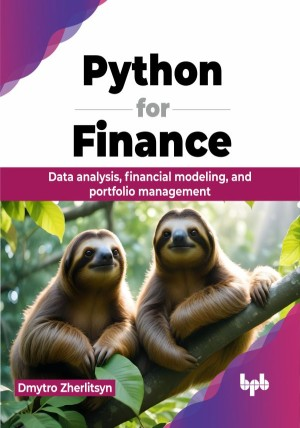

# Python for Finance

Data analysis, financial modeling, and portfolio management.

This is the repository for [Python for Finance
](https://bpbonline.com/products/python-for-finance?_pos=1&_sid=5d56c2fd3&_ss=r&variant=43983703408840),published by BPB Publications.

## About the Book
Python's intuitive syntax and beginner-friendly nature makes it an ideal programming language for financial professionals. It acts as a bridge between the world of finance and data analysis. 

This book will introduce essential concepts in financial analysis methods and models, covering time-series analysis, graphical analysis, technical and fundamental analysis, asset pricing and portfolio theory, investment and trade strategies, risk assessment and prediction, and financial ML practices. The Python programming language and its ecosystem libraries, such as Pandas, NumPy, SciPy, Statsmodels, Matplotlib, Seaborn, Scikit-learn, Prophet, and other data science tools will demonstrate these rooted financial concepts in practice examples. 

This book will help you understand the concepts of financial market dynamics, estimate the metrics of financial asset profitability, predict trends, evaluate strategies, optimize portfolios, and manage financial risks. You will also learn data analysis techniques using Python programming language to understand the basics of data preparation, visualization, and manipulation in the world of financial data.

## What You Will Learn
• Learn financial data analysis using Python data science libraries and techniques.

• Learn Python visualization tools to justify investment and trading strategies.

• Learn asset pricing and portfolio management methods with Python.

• Learn advanced regression and time series models for financial forecasting.

• Learn risk assessment and volatility modeling methods with Python.
